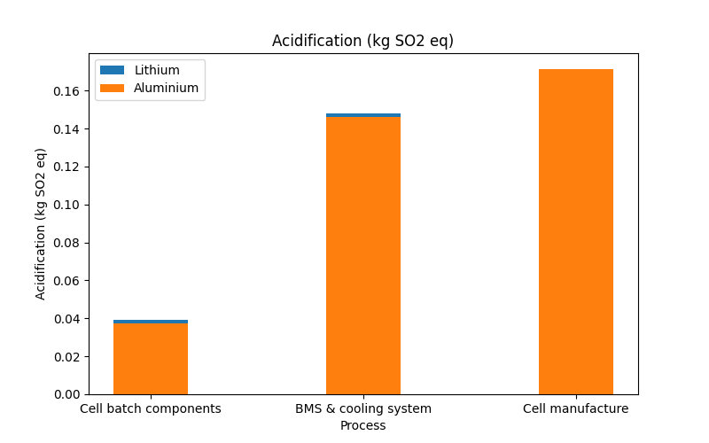

# Life Cycle Assessment of an Electric Scooter Battery

This repository presents an analysis of the environmental impacts of lithium-ion (Li-ion) and aluminum-ion (Al-ion) batteries used in electric scooters. The research includes a **Life Cycle Assessment (LCA)** comparing the two chemistries across several key environmental indicators.

## Project Overview

This work examines the environmental impact of batteries from a **cradle-to-gate** perspective, focusing on the following categories:

- **Energy Consumption (MJ)**
- **Global Warming Potential (kg CO₂ eq)**
- **Acidification (kg SO₂ eq)**
- **Eutrophication (kg PO₄ eq)**

The study aims to guide decisions for transitioning from Li-ion to Al-ion battery technology by assessing sustainability, manufacturing impacts, and supply chain considerations.

---

## Key Findings and Visualizations

### Environmental Impact Comparisons
#### 1. Global Warming Potential (kg CO₂ eq)

#### 2. Energy Consumption (MJ)

#### 3. Acidification (kg SO₂ eq)

#### 4. Eutrophication (kg PO₄ eq)

---

### Percentage Changes in Environmental Indicators

This chart demonstrates the percentage variation of environmental impacts between Li-ion and Al-ion batteries across different stages of the production process.

---

### Supply Chain Analysis
#### Kraljic Matrix

The Kraljic Matrix identifies critical and bottleneck items in the supply chain, such as lithium carbonate and cobalt oxide, and provides insights into procurement strategies.

---

### System Boundary Diagram

This system boundary diagram illustrates the cradle-to-gate life cycle stages of battery production, including raw material extraction, cell manufacturing, and recycling.

---

## Cumulative Cost Analysis
### Cumulative Cost Over Time for Different Configurations

This graph showcases the cumulative costs associated with different battery production configurations over time.

### Error Comparison for Different Models

This graph compares error margins between models and configurations.

---

## Methodology

### Data Analysis Techniques
- **Visualization Tools**: Used Python (Matplotlib) to generate bar charts and trend lines for impact comparisons.
- **Comparative Analysis**: Evaluated Li-ion and Al-ion batteries for environmental and economic performance.

### Tools and Software
- Python Jupyter Notebooks for data analysis.
- Life Cycle Assessment software for environmental impact calculations.

---

## Recommendations

- **Transition to Al-ion Batteries**: Despite higher initial production mass, Al-ion batteries demonstrate lower global warming potential and eutrophication impacts.
- **Improved Manufacturing**: Adjustments to production lines can enhance efficiency and reduce costs.
- **Future Research**: Further studies into material recycling and production optimization are recommended.

---

## Repository Contents

- **Graphs and Visualizations**: Includes all environmental impact comparisons and cumulative cost analyses.
- **Code Notebooks**: Python Jupyter Notebooks used for generating visualizations.
- **Documentation**: A PDF report detailing the Life Cycle Assessment.

---

## Citation

This project is based on a **Master's Dissertation** submitted to the University of Southampton:

> **Title**: Life Cycle Assessment of an Electric Scooter Battery – Materials, Manufacturing, and Supply Chain Management  
> **Author**: Abhinandan Thour  
> **Year**: 2024  

For more details, see the [full report](Life_cycle_assessment_of_an_electric_scooter_battery-Abhinandan_Thour.pdf).
